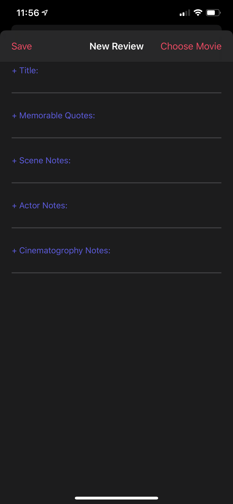

&nbsp;&nbsp;&nbsp;

# Cinescribe
[Cinescribe](https://github.com/CineScribe/CineScribe) is a bootcamp project I recently completed with a fellow student. The basic requirements for the app were to make network calls ([themoviedb.org](https://www.themoviedb.org/)'s REST api), persist data (accomplished through Firebase), and have clean UI.

I'm quite happy with the final product: Cinescribe allows users to search movies, see the associated cast & crew, and structure reviews to be posted onto social media platforms

&nbsp;&nbsp;&nbsp;&nbsp;&nbsp;&nbsp;&nbsp;&nbsp;&nbsp;&nbsp;&nbsp;&nbsp;&nbsp;&nbsp;&nbsp;&nbsp;

